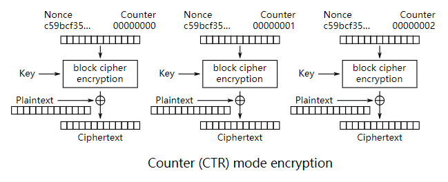
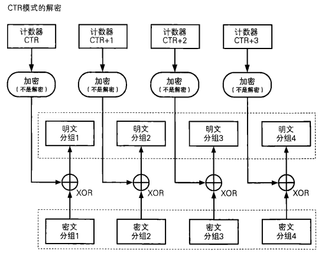

### CTR 模式

> CTR模式的全称是CounTeR模式（计数器模式）。<font color="red">CTR摸式是一种通过将逐次累加的计数器进行加密来生成密钥流的流密码</font>（下图）。
>
> CTR模式中，每个分组对应一个逐次累加的计数器，并通过对计数器进行加密来生成密钥流。也就是说，最终的密文分组是通过将计数器加密得到的比特序列，与明文分组进行XOR而得到的。

#### **这里我们就简单介绍一下AES的CTR模式的实现。**







#### 计数器的生成方法

> 每次加密时都会生成一个不同的值（nonce）来作为计数器的初始值。当分组长度为128比特（16字节）时，计数器的初始值可能是像下面这样的形式。


> 其中前8个字节为nonce（随机数），这个值在每次加密时必须都是不同的，后8个字节为分组序号，这个部分是会逐次累加的。在加密的过程中，计数器的值会产生如下变化：


> 按照上述生成方法，可以保证计数器的值每次都不同。由于计数器的值每次都不同，因此每个分组中将计数器进行加密所得到的密钥流也是不同的。也是说，这种方法就是用分组密码来模拟生成随机的比特序列。

#### OFB模式与CTR模式对比

> CTR模式和OFB模式一样，都属于流密码。如果我们将单个分组的加密过程拿出来，那么OFB模式和CTR模式之间的差异还是很容易理解的（下图）。OFB模式是将加密的输出反愦到输入，而CTR模式则是将计数器的值用作输入。


#### CTR模式的特点

> CTR模式的加密和解密使用了完全相同的结构，因此在程序实现上比较容易。这一特点和同为流密码的OFB模式是一样的。
>
> 此外，CTR模式中可以以任意顺序对分组进行加密和解密，因此在加密和解密时需要用到的“计数器"的值可以由nonce和分组序号直接计算出来。这一性质是OFB模式所不具备的。
>
> 能够以任意顺序处理分组，就意味着能够实现并行计算。在支持并行计算的系统中，CTR模式的速度是非常快的。

#### 几种模式的对比总结


AES的CTR模式代码实现

```
func AesCTR_Encrypt(plainText,key[]byte)[]byte{
	//判断用户传过来的key是否符合16字节，如果不符合16字节加以处理
	keylen:=len(key)
	if keylen==0{   //如果用户传入的密钥为空那么就用默认密钥
		key=[]byte("wumansgygoaescbc")   //默认密钥
	}else if keylen>0&&keylen<16{  //如果密钥长度在0到16之间，那么用0补齐剩余的
		key=append(key,bytes.Repeat([]byte{0},(16-keylen))...)
	}else if keylen>16{
		key=key[:16]
	}
	//1.指定使用的加密aes算法
	block, err := aes.NewCipher(key)
	if err!=nil{
		panic(err)
	}

	//2.不需要填充,直接获取ctr分组模式的stream
	// 返回一个计数器模式的、底层采用block生成key流的Stream接口，初始向量iv的长度必须等于block的块尺寸。
	iv := []byte("wumansgygoaesctr")
	stream := cipher.NewCTR(block, iv)

	//3.加密操作
	cipherText := make([]byte,len(plainText))
	stream.XORKeyStream(cipherText,plainText)

	return  cipherText
}

func AesCTR_Decrypt(cipherText,key []byte)[]byte{
	//判断用户传过来的key是否符合16字节，如果不符合16字节加以处理
	keylen:=len(key)
	if keylen==0{   //如果用户传入的密钥为空那么就用默认密钥
		key=[]byte("wumansgygoaescbc")   //默认密钥
	}else if keylen>0&&keylen<16{  //如果密钥长度在0到16之间，那么用0补齐剩余的
		key=append(key,bytes.Repeat([]byte{0},(16-keylen))...)
	}else if keylen>16{
		key=key[:16]
	}
	//1.指定算法:aes
	block, err:= aes.NewCipher(key)
	if err!=nil{
		panic(err)
	}
	//2.返回一个计数器模式的、底层采用block生成key流的Stream接口，初始向量iv的长度必须等于block的块尺寸。
	iv := []byte("wumansgygoaesctr")
	stream := cipher.NewCTR(block, iv)

	//3.解密操作
	plainText := make([]byte,len(cipherText))
	stream.XORKeyStream(plainText,cipherText)

	return plainText
}
```

